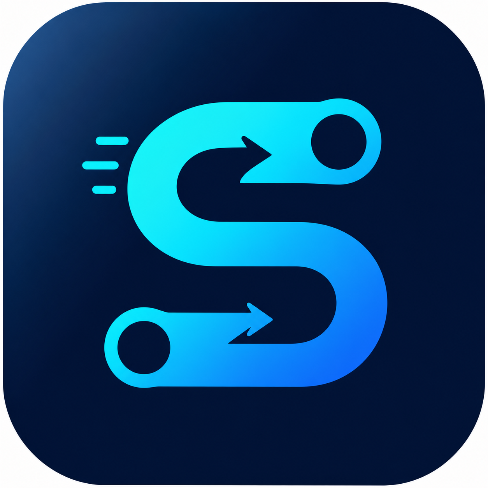

<br />

<p align="center">
  <a href="https://github.com/SaveW1nd/YKSprite">
    
  </a>

  <h3 align="center">YKSprite</h3>

  <p align="center">
    一个本地优先的雨课堂自动化管理面板，用于账号管理、API 配置、课堂监控和答题记录查看。
    <br />
    <br />
    <a href="https://github.com/SaveW1nd/YKSprite/issues">报告 Bug</a>
    ·
    <a href="https://github.com/SaveW1nd/YKSprite/issues">提出新特性</a>
  </p>
</p>

<p align="center">
  <a href="https://github.com/SaveW1nd/YKSprite/blob/main/LICENSE">
    
  </a>
  <a href="https://github.com/SaveW1nd/YKSprite">
    
  </a>
  <a href="https://github.com/SaveW1nd/YKSprite">
    
  </a>
</p>

## 目录

- [关于项目](#关于项目)
- [功能特性](#功能特性)
- [项目结构](#项目结构)
- [上手指南](#上手指南)
  - [方式一：Docker Compose 推荐](#方式一docker-compose-推荐)
  - [方式二：本地开发运行](#方式二本地开发运行)
- [常用命令](#常用命令)
- [数据与安全](#数据与安全)
- [路线图](#路线图)
- [版本控制](#版本控制)
- [作者](#作者)
- [版权说明](#版权说明)

## 关于项目

YKSprite 是一个本地优先的课堂自动化管理工具。它把账号状态、API Key、课堂监控、自动答题任务和历史答题记录集中到一个 Web 管理面板中，方便在本机或自托管环境里使用。

项目默认使用 SQLite 存储运行数据，所有账号 session、截图、数据库和本地状态都保存在本地 `data/` 目录中。

## 功能特性

- 账号管理：扫码登录、账号状态、监控开关和进课时长配置。
- API 管理：添加、检测、启用和删除 Qwen API Key。
- 仪表盘：查看账号、课堂、任务队列、异常提醒和最近答题。
- 答题情况：查看题目截图、提交答案、课程、账号和提交状态。
- 后台监控：查看 worker、课堂上下文、任务和运行日志。
- Docker 运行：推荐使用 Docker Compose 一键启动前后端。

## 项目结构

```text
YKSprite
├── apps
│   ├── service       # Fastify 后端、SQLite、监控、答题与 API 配置
│   ├── web           # React 管理面板
│   └── desktop       # Electron 外壳，当前为可选能力
├── packages
│   └── core          # 共享的题目、答案解析和 prompt 工具
├── docker            # Dockerfile 与 docker-compose 配置
└── data              # 本地运行数据，已被 Git 忽略
```

## 上手指南

### 方式一：Docker Compose 推荐

Docker Compose 是推荐启动方式。它会同时启动：

- `service`：后端服务，监听 `3000`
- `web`：前端管理面板，监听 `5173`

#### 环境要求

- Docker
- Docker Compose

#### 启动

```bash
docker compose -f docker/docker-compose.yml up --build
```

打开浏览器访问：

```text
http://localhost:5173
```

后端健康检查：

```text
http://localhost:3000/health
```

#### 停止

```bash
docker compose -f docker/docker-compose.yml down
```

#### 数据目录

Docker Compose 会把本地 `data/` 挂载到容器内：

```text
./data -> /app/data
```

数据库、截图、账号 session 和运行状态都会保存在这里。

### 方式二：本地开发运行

如果你需要改代码或调试，可以使用本地开发方式。

#### 环境要求

- Node.js 22
- pnpm 10.8.0

#### 安装依赖

```bash
pnpm install
```

#### 启动后端

```bash
pnpm --filter @yksprite/service build
pnpm start:service
```

后端默认监听：

```text
http://127.0.0.1:3000
```

#### 启动前端

打开另一个终端：

```bash
cd apps/web
pnpm dev
```

访问：

```text
http://localhost:5173
```

Vite 会把 `/api/*` 请求代理到 `http://127.0.0.1:3000`。

## 常用命令

```bash
pnpm lint
pnpm build
```

后端 Docker 镜像脚本：

```bash
pnpm docker:build
pnpm docker:run
pnpm docker:smoke
```

完整前后端体验请优先使用：

```bash
docker compose -f docker/docker-compose.yml up --build
```

## 数据与安全

YKSprite 会在本地保存运行数据，其中可能包含账号 session、cookie、题目截图、数据库和 API 配置状态。

以下内容已被 `.gitignore` 和 `.dockerignore` 忽略：

- `data/`
- `**/data/`
- `*.db`
- `*.sqlite*`
- `*.log`
- `*.bak`

发布源码、打包归档或提交 PR 前，请不要上传：

- 本地数据库
- 账号 cookie/session
- API Key
- 题目截图
- 运行日志

## 路线图

- [x] 后端接口化答题流程
- [x] API Key 管理与检测
- [x] 答题记录与截图预览
- [x] 仪表盘与后台监控
- [x] Docker Compose 前后端启动
- [ ] 桌面版发布流程完善
- [ ] 更完整的使用文档和截图

## 版本控制

当前版本记录在根目录 [VERSION](./VERSION) 中，并与各 workspace package 的 `version` 字段保持一致。你也可以在仓库的 Releases 页面查看可用版本。

## 作者

SaveW1nd

- GitHub: [@SaveW1nd](https://github.com/SaveW1nd)

## 版权说明

本项目基于 MIT 协议开源，详情见 [LICENSE](./LICENSE)。
